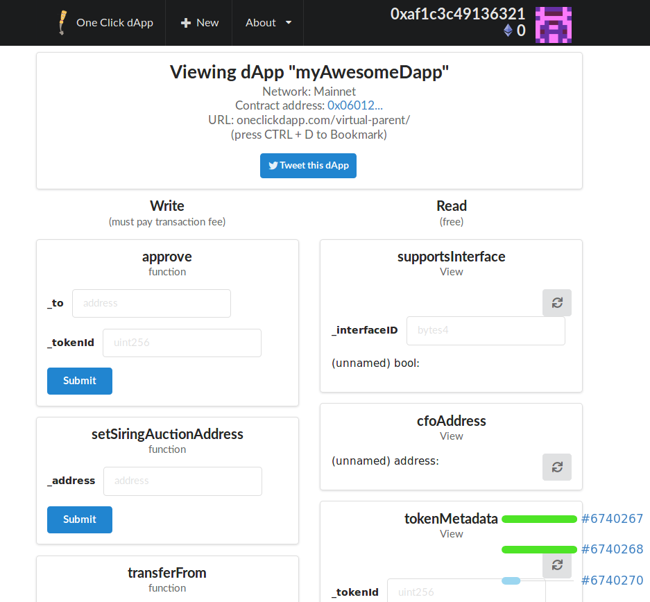
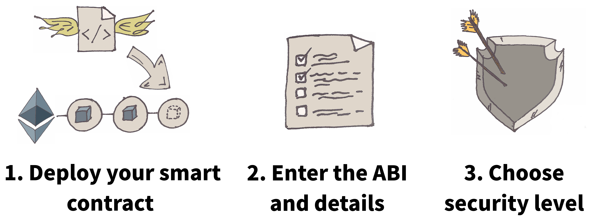
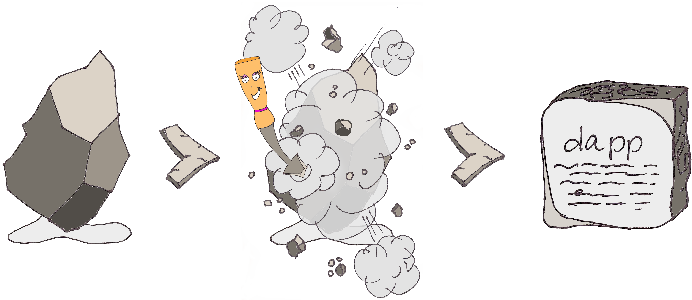

<h1 align="center">One Click dApp</h1>

<b> Instantly build a dApp with a simple URL to bookmark or share with a friend.:zap::wrench::link: :shipit:</b>

<h3 align="center"> Shareable dApps are a click away at http://oneclickdapp.com

## Problem

You created a smart contract...now what?

**There is no easy way to share a smart contract interface!**

The goal of this project is to make it easier to interact with smart contracts. OneClickDapp instantly builds you a dApp with a simple URL to bookmark or share with a friend. Anyone with the dApp URL can interact with _your shiny new smart contract_, and access all functions at the correct address/network. Don't write a single line of front-end code. Forget about verifying your contract on Etherscan or MEW. Your dApp is just one click away!
 
 

 

## Features Completed

:white_check_mark: Custom dApp URL e.g. http://oneclickdapp.com/garcia-erosion

:white_check_mark: Recent public history of dApps

:white_check_mark: Auto-save your dApps using wallet address

:white_check_mark: Clone an existing dApp (sources available: [MEW ethereum-lists](https://github.com/MyEtherWallet/ethereum-lists))

:white_check_mark: In-page wallet for new ethereum users

:white_check_mark: Twitter share Button

:white_check_mark: Medieval stone-sculpting theme

## Planned

- Ganache forking to emulate any mainnet dApp
- IPFS for saving dApps
- Custom ENS domains e.g., "myDapp.oneclickdapp.ETH"
- Full decentralization for permanence and security
- "Copy the code" button to build your own React app
- Display Events and Transactions using Dapparatus

## Run the app locally

1.  Run `npm install` in both root directory, and in `/client`
2.  Create `config.js` in `./db/` and enter your mongoDB URL
    > process.env.MONGODB_URI = "mongodb://..."
3.  cd to root directory and run `npm start`

## Contributions welcome!

This tool is primarily maintained by a single person. It is self-funded and free to use.

Please consider helping by submitting an issue or PR.

## Check out my other free blockchain resources

- [Walrus Paper Wallet Generator](https://github.com/blockchainbuddha/Walrus-Paper-Wallet-Generator)- Print hundreds of paper wallets quickly.
- [Smart Contract Troubleshooter](https://github.com/blockchainbuddha/Solidity-Troubleshooting-Guide)- A quick checklist to prevent ripping out your hair.
- [Patrick's blockchain resources](https://github.com/blockchainbuddha/Intro-to-Blockchain)- If I taught it, you can find it here.

## Contact

[Patrick](https://twitter.com/pi0neerpat),
[Joseph](https://twitter.com/cupojoseph)
