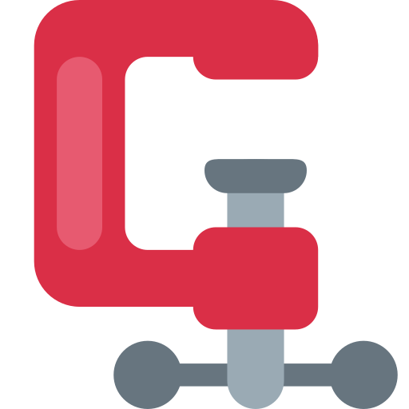
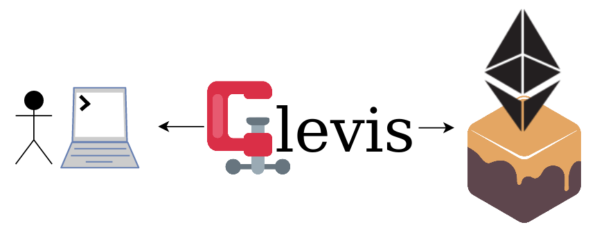
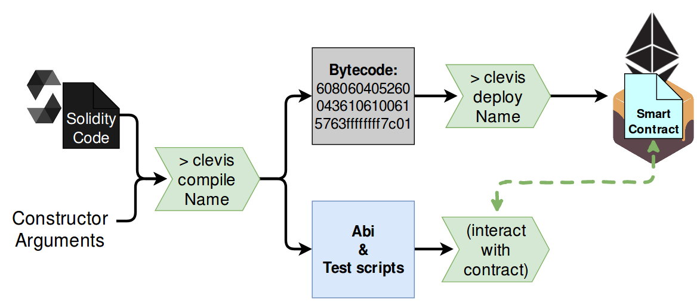
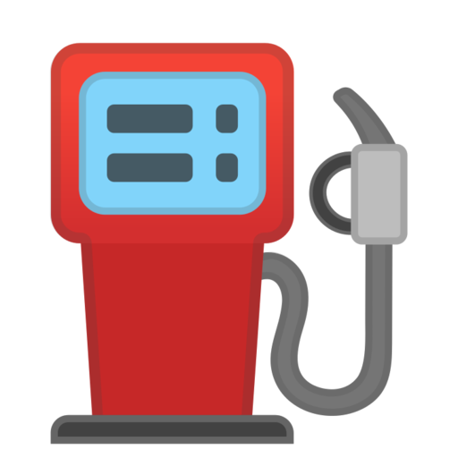

<p align="center">
</p>

# Creating a new **️Clevis** project:

_Target audience:_ You've written and deployed several smart contracts using [Remix](remix.ethereum.org). Now you need a robust development environment with automated testing tools, and an easy-to-use command line interface.

## Install  Clevis

0.  Requirements: Install npm and node.js (see https://docs.npmjs.com/getting-started/installing-node).

1.  Download and create a binary of Clevis

```
git clone https://github.com/austintgriffith/clevis
cd clevis
npm install
sudo npm link
```

2.  Navigate to a new project folder, then

```
npm link clevis
clevis init
```

(You may have to enter root password during this process.)

3.  Check your web3 version, and be sure you are using the correct documentation for web3 ([learn more](https://github.com/blockchainbuddha/Intro-to-Blockchain#using-web3))

```
clevis version
```

4.  Test out a command.

```
clevis sha3 "Hello World"
>> SHA3
>> 0x592fa743889fc7f92ac2a37bb1f5ba1daf2a5c84741ca0e0061d243a2e6707ba
```

Great job!

## Set up a local  Ethereum network

5.  Instead of developing on the main Ethereum network, or a test-network, we will install Ganache-CLI  to run a local instance, as well as a JavaScript test framework tool called mocha .

```JavaScript
npm install -g ganache-cli mocha
```

> Ganache allows us to process transactions :zap: instantly! Pretty sweet right?

6.  In a **new terminal**

```
ganache-cli
>> ... // (lots of stuff here)
>> Listening on 127.0.0.1:8545
```

This starts a local instance of the Ethereum Virtual Machine (EVM). Ganache-CLI also creates a new  wallet with multiple ethereum "accounts" (0xab23f...) and each are funded with 100 ETH. If you get stuck using Ganache-CLI [read the docs](https://github.com/trufflesuite/ganache-cli/blob/master/README.md).

> _Go forth and make mistakes_! Ganache-CLI is merely an instanceof the EVM, and is _only running on your machine_.

Here's how our set-up looks so far.

<p align="center">

</p>
7. Lets ensure Clevis can talk with Ganache-CLI by asking for your  wallet accounts.

```javascript
clevis accounts
>> Reading Accounts...
>> ['0xf2A0DD5999c23f53fE8819CBbc06d2e2B05b9093',
>>   '0x25a62dE56EF4fe5882336b05AbF202d1375272dD',
>>   '0x367347648F02A6c6e0f5126185652332e91f2d00',
>>   '0x5aB26450D93Bd70c66CD575e47B4c72E91df876B',...
```

Now make a transaction by sending `0.2 ETH` from account 0 to account 1. The proper syntax is

#### clevis send [amount][fromindex] [toindex]

```javascript
clevis send 0.2 0 1
```

This is a good spot to try out some other commands. See the full list with

```javascript
clevis help
```

Excellent work so far!

## Ceate your  Solidity contract

> Note: these are usually referred to as "Smart Contracts." However they are neither smart, nor a contract. Can you think of a better term?

8.  Create a new contract

```javascript
clevis create Name
```

Lets take a look at our project directory now

```java
myproject
│   accounts.json            // Wallet accounts from Ganache-CLI (clevis accounts)
│   clevis.json              // Config. for network, gas price etc.
│   contracts.clevis         // Tracks contracts
│   ...
│
└───contracts
│   └───Name                 // Each contract has a folder
│       │   arguments.js     // Constructor arguments when deploying
│       │   dependencies.js  // Imports other contracts
│       │   Name.sol
│
└───openzeppelin-solidity    // Commonly used contracts
└───src                      // Our application lives here
└───tests                    // Useful test scripts
```

9.  Paste in the example code:

```solidity
pragma solidity ^0.4.24;

import 'openzeppelin-solidity/contracts/ownership/Ownable.sol';

contract Name is Ownable{
  string public name;

  constructor(string _name) public {
    name = _name;
  }

  function setName(string _name) onlyOwner public returns (bool){
    name = _name;
    return true;
  }
}
```

10. Since we are importing a contract from the OpenZeppelin-Solidity, we must modify `dependencies.js` so the compiler will know where to look:

```js
const fs = require('fs');
module.exports = {
  'openzeppelin-solidity/contracts/ownership/Ownable.sol': fs.readFileSync(
    'openzeppelin-solidity/contracts/ownership/Ownable.sol',
    'utf8'
  )
};
```

Our contract requires one argument when it's deployed. This is provided in `arguments.js`

```js
module.exports = ['Hello world'];
```

11. Compile

```js
clevis compile Name
```

We now have some some new files in the contract folder

```java
myproject
└───contracts
│   └───Name
│       │   Name.sol
│       │   ...
|       │   Name.abi       // Application binary interface
│       │   Name.bytecode  // Bytecode for submitting to Ganache-CLI
│       │   Name.compiled  // Compiled contract + imported contracts
│       │
│       └───.clevis        // Auto-generated test commands
│              |   eventOwnershipRenounced.js
│              |   setName.js
│              |   transferOwnership.js
│              |   ...
│  ...
```

## Deploy your contract to  Ganache-CLI

12. Deploy from account 0 using this syntax

#### clevis deploy [contractname][accountindex]

```js
clevis deploy Name 0
```

Notice even more new files in our contract folder.

```java
myproject
└───contracts
│   └───Name
│       │   Name.sol
│       │   ...
│       │   Name.address       // Contract address on the Ganache-CLI network
│       │   Name.blockNumber   // Block number where contract was deployed
│       │   Name.head.address  // ???
│       │   ...
│  ...
```

Let's review what just happened. During compilation, Clevis compiled our contract and arguments into bytecode, which is ready to be submitted to our Ganache-CLI blockchain. We also generated the contract Abi (Application binary interface) and some useful test scripts in the `.clevis` folder, whcih will allow us to communicate with our deployed contract.

<p align="center">

</p>
13. Let's try a test script now. Use the script `name` to get the value of `name` from your contract. Use this syntax:

#### clevis contract [scriptname][contractname] [[accountIndex]] [[contractArguments...]]

```javascript
clevis contract name Name
>> CONTRACT
>> //...(tons of useful information)
>> Hello world
```

Awesome! We can now request information from our smart contract. This was a simple ".call()" function, which doesn't take arguments. Call functions don't require a  gas transaction fee, so we didn't need to specify an account.
Here is the code that Clevis just ran for us:

```javascript
// Load dependencies for talking to Ganache-CLI using Web3
const ganache = require("ganache-cli");
const Web3 = require("web3");
// Get information about our deployed contract
const contractInterface = require("./contracts/Name/Name.abi");
const contractAddress = require("./contracts/Name/Name.compiled");
// Instantiate web3 object
const web3 = new Web3(ganache.provider({ port: "127.0.0.1:8545" }));
// Instantiate contract object at the correct address
const name = await new web3.eth.Contract(contractInterface, contractAddress);
// Finally, query our deployed Name contract using ".call()"
const response = await contract.methods.name().call();
console.log(response);
```

Good thing you didn't need to write that!

14. Now lets make a transaction that Δ changes the state of the contact, which will require a  gas transaction fee. We will need to specify an account in our  wallet. Let's use the `setName` function by calling the appropriate Clevis test script.

```javascript
clevis contract setName Name 0 "My new name"
>>
>> transactionHash:0x656600d6db9aa7fb814662c41657abe43074dc05b7bbb66edec5a6736c4e49b1
>> { transactionHash: '0x656600d6db9aa7fb814662c41657abe43074dc05b7bbb66edec5a6736c4e49b1',
>>   transactionIndex: 0,
>>   blockHash: '0xa2918570f31743aaba0fd097dc0bed1fef0a311ee0d59a1d006b6578d5a27fb9',
>>   blockNumber: 7,
>>   gasUsed: 34010,
>>   cumulativeGasUsed: 34010,
>>   contractAddress: null,
>>   logs: [],
>>   status: true,
>>   ...
```

If you're successful, you'll see a transaction hash (think of as a receipt), and `status: true`.
Clevis just ran all the code from the previous step, except instead of `contract.methods.name().call()`, it ran the following.

```javascript
const accounts = await web3.eth.getAccounts();
await name.methods.setName("My new  name").send({
  from: accounts[0],
  gas: 1300000
});
```

Remember that ".call()" functions do not require gas, and simply read the current state. However ".send()" functions modify the state of the contract, therefore we must specify an account to pay the  gas transaction fee.

#### Congratulations! we now know how to create a new contract using Clevis, and how to read and write using the `clevis contract` commands. Next up is building out the front-end.

## Front-end Coming soon!
